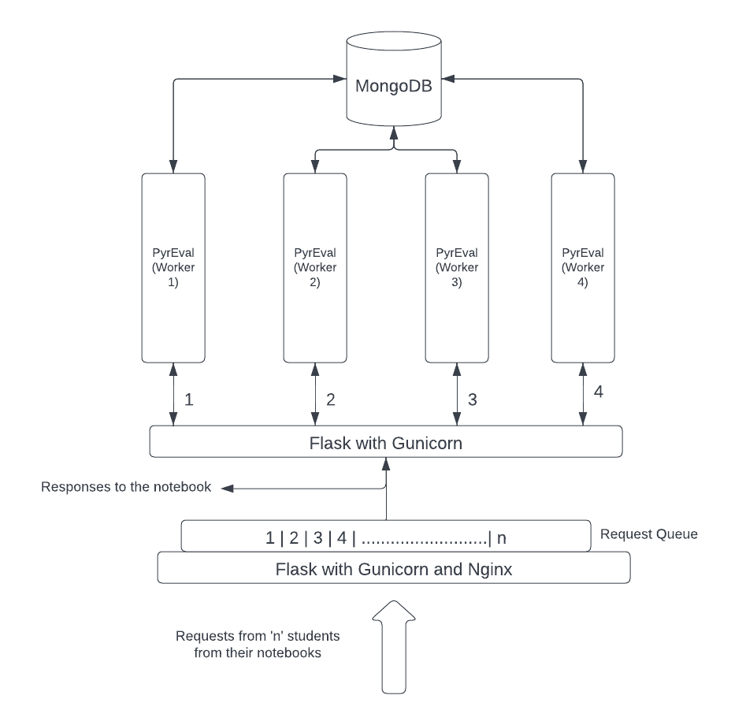
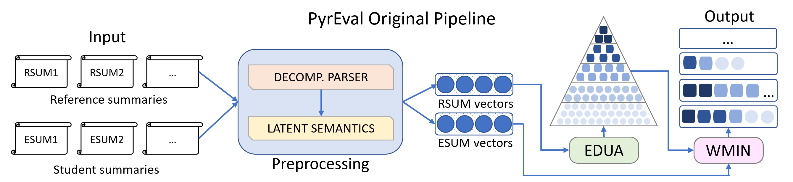

# PyrEval 2
## PyrEval_mongo
The documentation for PyrEval in this branch is similar to the main branch, much of which is copied below after this
introduction to the PyrEval-mongo branch. This mongo branch of PyrEval is for utilizing a mongo database to store 
inputs and outputs, and to run PyrEval as a service.  This branch was developed to support use of PyrEval in classrooms 
as part of a research project. The overall design of this service, which can use multiple workers through gunicorn,
is illsutrated in the figure below:



With PyrEval_mongo, we have integrated PyrEval with MongoDB and built it into a RESTful service so it can be used by the front end Notebook to process web requests. This version of PyrEval will enable students to submit their essays and get immediate feedback.

The initial setup of MongoDB can be found in the Initial_Setup_Queries.mongodb in the MongoDB folder.

There are 3 major PyrEval scripts in this version, and changes throughout to various PyrEval scripts.  The figure above shows the design of the Mongo
version of PyrEval, and the three major PyrEval scripts are identified below.  Any script whose file name ends in _mongo_maj.py


1. pyreval_service.py
This code is the flask implementation of PyrEval and can be run as a flask instance. Requests to this can be sent using Postman or using Axios in another script.
This is by default run on the local host and 5000 port. Requests to this service can be sent using the below URL in the mentioned JSON format.
The request needs to be a POST request to the URL http://127.0.0.1:5000/flask_with_request

The JSON format to be sent is as below,

{
"student_id":"<<student id>>",
"class_id" :  "<<class id>>",
"teacher_id" : "<<teacher id>>",
"essay_number" : "<<essay number>>",
"essay_version" : "<<essay version>>"
}
    

This function can also be run on multiple workers using the command, 
    
    gunicorn --workers 4 --timeout 1200 --log-level=DEBUG --bind 0.0.0.0:5000 pyreval_wsgi:app
    
2.PyrEval_mongo_launcher:
This script runs PyrEval with MongoDB in launcher mode. Also, it only runs for one student at a time and the student metadata should be modified in the PyrEval_mongo_launcher at line 283 where the student metadata for a student in the DB is provided.
    
3.PyrEval_mongo_serialtesting:
This script currently takes "n" number of student essays randomly from the database and processes those essays.

### Note:
Before running pyreval mongo the directory in the parameter.ini file needs to be updated.
    
# PyrEval Documentation:
PyrEval Copyright (C) 2017 Yanjun Gao

This is the package for running PyrEval (which includes a new variant PyrEval+CR). The current package is written in Python 3.6 and is an update of the original PyrEval version [Link](https://github.com/serenayj/PyrEval/) which used PyrEval 2.7. This version comes with many optimizations and other changes to facilitate experiments and parameter tuning.  In particular, many of the recent and ongoing changes facilitate use of PyrEval for real-time assessment of student writing. (Has been used with Python versions up to 3.9 on MAC OS, does not work as well on Windows.)

[Here](https://youtu.be/i_wdH3__urY) is a demo presented at the [CLIEDE2017](https://sites.psu.edu/cliede2017/) workshop. Look for a more recent demo video soon.

Please cite these papers if you use our code. 

[1] Gao, Yanjun; Sun, Chen; Passonneau, Rebecca J. 2019. Automated Pyramid Summarization Evaluation. Proceedings of Conference on Computational Natural Language Learning (CoNLL). [Link](https://www.aclweb.org/anthology/K19-1038/) 

[2] Gao, Yanjun; Warner, Andrew; Passonneau, Rebecca J. 2018. Pyreval: An automated method for summary content analysis. Proceedings of the Eleventh International Conference on Language Resources and Evaluation (LREC).  [Link](http://www.lrec-conf.org/proceedings/lrec2018/pdf/1096.pdf)

## Table of Contents
**[Introduction](#introduction)**<br>
**[Requirements](#requirements)**<br>
**[Components and Directories](#components-and-directories)**<br>
**[HOW TO USE - Launcher (Recommended)](#how-to-use---launcher-recommended)**<br>
**[HOW TO USE - Manual](#how-to-use---manual)**<br>
**[Acknowledgement](#acknowledgement)**<br>

## Introduction 
PyrEval is a tool originally developed to automate the pyramid method for summary content evaluation [6, 7, 8]. It has recently been extended to assess the content of students' short, written science explanations (PyrEval+CR). PyrEval constructs a pyramid, which is a weighted content model of semantically coherent units (typically propositions) discovered in a small sample (e.g., 4 or 5) of expert reference summaries of one or more source texts. It then applies the content model to automatically evaluate the content of new summaries. It automates a manual method that was developed over a decade ago [6, 7], and found to be extremely reliable [8]. Instead of creating an emergent content model from reference summaries, PyrEval+CR is for use with a computable rubric (CR), which has the form of a pyramid, but which represents assessment criteria similar to an analytic rubric [10, 11]

The tool is aimed at two audiences. It can help educators evaluate the content of students’ short, written passages (summaries or essays). Summaries of source texts that students write to a prompt are a commonly used vehicle to teach reading and writing skills, and to assess students’ knowledge of content [8]. It has performed well on college students' summaries across multiple domains, and on sections of legal case briefs written by law students. PyrEval can also assess automated summarizers [1].

Below is an image showing the original pipeline and log output. 


PyrEval version 2 has been modified to include the original pipeline (shown again below) or a new pipeline for use with a computable rubric (PyrEval+CR) as described in [10, 11].  



![Pyreval2 pipeline: for PyrEval+CR [7,8]](Img/pyreval_mod.png)

## Requirements
### Installation Requirement 
1. Python 3.6 (Has been tested with python versions up to 3.9; not guaranteed to work with higher versions)
2. Stanford CoreNLP System [5], see download [link](https://stanfordnlp.github.io/CoreNLP/). PyrEval has been tested with version 4.4.0 of Stanford CoreNLP. The directory should be placed inside the Stanford subdirectory of the repository.
3. Install the packages listed in requirements.txt to the environment along with additional dependencies:
```
pip install -r requirements.txt
sudo apt install python-lxml         ## 02/16/23 - Optional; for using Windows/Cygwin
python3 -m nltk.downloader punkt
```
4. Java DK
5. Perl 
6. (Optional) Install the ABCD package to use ABCD, a graph based Neural Network model for sentence decomposition instead of the Decompostion Parser [link](https://github.com/serenayj/ABCD-ACL2021). 

### Data Requirement 
For the full pipeline, PyrEval requires 4 to 5 human-written summaries or short essays in plain text files (referred throughout as “wise crowd” summaries/essays); any number of summaries/essays to score (referred throughout as “peer” summaries).  These must be placed in the Raw subdirectory under their respective subsirectories.

For the modified pipeline, PyrEval+CR requires a computable rubric, which converts a rubric to assess short essays to the format of a pyramid that would be created automatically from wise crowd summaries or short essays.

## Component Description

### Directories
Here is an explanation of the folders present in the PyrEval package: 
- ABCD: The directory where ABCD repository should be placed.
- Baseline: The ground truth scores for the sample dataset based on the manual annotations.  It is in the form of  .csv file. It can be used for verifying that PyrEval as been run correctly, using the datasets in the Datasets folder.
- Datasets: A dataset to generate the baseline results (the crypto-currency dataset from [1]).
- img: image files used in the README.md
- Preprocess: For preprocessing your raw texts (step 0 and 1). Currently the decomposition into sub-sentence clauses uses Stanford CoreNLP tools [6], and conversion to semantic vectors uses WTMF [3, 4] In principle, these can be replaced by other methods. See the parameters.ini file.
- Pyramid: Code for processing model summaries (step 2). PyrEval uses model summaries that must be placed in Raw/model to build the pyramid, using the EDUA algorithm [1]. 
- Raw: Two subfolders (model and peers) store plain text files containing the model summaries (or other genres of model texts) and the peer text (summaries or other inputs to be assessed).
- Scoring: Code for scoring peer summaries by the pyramid (step 3 of the launcher).
- log: This folder is created at the end of processing peer files, and stores PyrEval's log output; see the image above of example log output.
- Stanford: The directory where StanfordCoreNLP is placed.

### Scripts
Here is a brief description of the relevant python scripts which can be used for batch execution or to calculate correlations of PyrEval scores with ground truth scores.
- correlations.py: Based on the inputs, calculates the correlations between the scores of the baselines and the multiple iterations of pipeline runs.
- pipeline.py: Sample pipeline to execute the PyrEval packages manually. This can be used for grid search and running the pipeline with multiple datasets.
- pyreval.py: The script starts the launcher which can be used to execute the pipeline in stages. Using the launher is discussed in the next [section](##how-to-use---launcher-recommended)
- pyreval_flask.py: Flask implementation of the pipeline (Not stable)
- sanity.py: This script will check whether all required directories like Stanford, Scoring, Raw/model, etc. are present and whether the required dependencies are installed. Note: If you are getting some error with nltk, then please refer to the Notes section in this README.
- splitsent.py: Does some cleaning and checking of input files, and splits the file into one sentence per line.
- stanford.py: Runs the Stanford Core NLP tools [5].
- to_xml.py: Used to convert a human readable Pyramid file (requires correct formatting) into a PyrEval readable Pyramid xml file, which has a "pyr" file extension.

### Configuration
The configuration file `parameters.ini` contains all the parameters and paths for the package with a brief description of the parameter options provided below
- Paths: First, you must change the basedir path in parameters.ini to the location you are usin to run PyrEval. The relative paths are based on the absolute path of the basedir. Changing of the relative paths is not recommended.
- *outputpyramidname*: Change this to change the name of the constructed Pyramid.
- WMIN parameters (see [11]):
    - *edgethreshold*: Changes the edge threshold when constructing the hypergraph using cosine similarities. 
    - *topkscus*: The number of scu candidates for each segment in the hypergraph. Range: 2-8 tested.
    - *sortingmetric*: The metric used for selecting the top k CUs to include in an internal node of the WMIN hypergraph. Acceptable values: product, cosine, stddev, wtdsum, normsum.
    - *weightingmetric*: The metric used to assign weight to the hypergraph node. Acceptable values: product, cosine, stddev, wtdsum, normsum.
    - *weightingscheme*: The weighting scheme which decides the weight of each match to a CU. Acceptable values: sum, average, max.
- Vectorization: The *method* determines the methodology used when contructing the phrase vectors. Implemented values: wtmf, glove.
- Segmentation: 
    - *method*: Describes which method for sentence decomposition is used. Implemented values: dcp (recommended); abcd.
    - *decompositionmode*: Decides which mode of decompostion parser to utilize. Acceptable values: default, sentence, sentsplit, vpsbar, convp.
    - *minsentencelength*: Determines the minimum length of an independent clause within decomposition parser. Range: 1-7 tested. 

## HOW TO USE - Launcher 

PyrEval comes with a launcher for ease of use, and has been tested with Linux. The launcher is stable but requires manual input to run all the stages of pipeline. 

### Launcher Preparation
The *basedir* parameter in the parameters.ini file should be changed to the current working directory. Other parameters should be changed based on the run expectation. 

You must place your summary text files in the `Raw` folder in PyrEval's directory.

1. Place model summaries in `Raw/model`.
2. Place peer summaries in `Raw/peers`.

The Stanford CoreNLP System must be extracted to the `Stanford` folder in PyrEval's directory.

It is also recommended to first run "sanity.py" by: python3 sanity.py (or python sanity.py, if using Python2). See above under ### Scripts


### Usage

#### 1. Launch the launcher with `<python_exec> pyreval.py`.

`<python_exec>` is your system's python interpreter. Normal usage is `python pyreval.py`.

#### 2. Set your Python interpreter (if needed) using the `i` command.

The `i` command lets you set a custom Python interpreter. The default setting is `python`. You may wish to manually specify your Python interpeter if you do not have `python` on your path or if you wish to use another Python installation on your system. What you type after `i` will be called exactly as though it were typed on the command line.

Example: Renamed Python executable (e.g., homebrew)
```
>>> i python2
```

The default Python interpreter is present in the parameters file.

#### 3. Run PyrEval commands

Once you have set your interpreter, you are ready to run PyrEval. You run PyrEval commands by typing the number of the command you wish to run. The launcher has 5 steps represented as integer inputs, corresponding to 1) the sentence splitting, 2) creating the xml for the tokenized version of the input text, 3) creating the sentence segments and converting them to semantic vectors, 4) running EDUA to create the pyramid, 5) and running WMIN to assess the content of the peer inputs.  E.g.:

```
>``>> 1
...
>>> 2
...
>>> 3
...
>>> 4
...
>>> 5
```

Typing `0` (automatic mode) will run through each of the 5 PyrEval steps in sequence. It is equivalent to running the `1`, `2`, `3`, `4`, and `5` commands in order. It is not recommended that you use automatic mode for your first run of PyrEval in case there are errors, but once you are confident that the PyrEval toolchain is running correctly, automatic mode is a convenient way to run through each step in sequence.

#### 4. Optional command flags for launcher's step 5

The fifth PyrEval step (scoring) supports various command line flags. 

-options:

-p <path/to/pyramid or pyramids>

-a print verbose

-t print scoring table

-o specify output (default is '../results.csv')

-l specify path for log file (default is "../log")

You may use these flags just as you would on the command line. E.g.,

```
>>> 5 -t
```

In automatic mode, any flags passed will be forwarded to the scoring step ONLY. E.g., 
```
>>> 0 -t
```

#### 5. Clean directories

**WARNING**: Running the clean command will delete *all* files generated by PyrEval, including the results file. If you wish to save your results, save them to a different directory before cleaning. The clean command will not delete your raw text files (`Raw/model`; `Raw/peers`), but it MAY delete other files you place in other directories. Please back up your files, and use this command at your own risk.

Typing `c` will clean the PyrEval directories of all files generated by the toolchain. It will not delete your original text input files and files in the `Datasets`, `Baseline` and `Results` directories. This is useful for performing a "clean run," and the most common use for this command to clean all of the directories of the previous data before running on new input files. 

#### 6. Exit

To exit the PyrEval launcher, simply input `q` and execute.


## HOW TO USE - Manual

A script needs to be written to execute the pipeline a sample of which has been provided in `pipeline.py`. 

### Step 00 (If your data is already one sentence per line and special characters removed, you don’t need this step): Split your documents into lines and clean up. Using the script splitsent.py by using the following function: 

```
split(path_to_raw_text, path_to_output)
```
This step has to be done twice, once for wise crowd summaries, once for peer summaries.

### Step 0: Download and run Stanford CoreNLP to generate xml files. Unpack the downloaded package files and move the folder in the Stanford directory. This step has to be done twice, once for wise crowd summaries, once for peer summaries
 
Copy stanford.py to the Stanford CoreNLP folder, then use the following function from the stanford.py script: 
```
stanfordmain(path_to_raw_text, mode, path_to_PyrEval)
```
where mode: 1: peer summries; 2: wise_crowd_summaries.

### Step 1: Preprocess files to generate sentence embeddings. 
We are using vectorizations method by WTMF, created by Weiwei Guo. [7][8]. There is also the option to use GloVe vectors [9]

cd to Preprocess directory, then run preprocess.py:
```
python preprocess.py mode 
``` 
where mode: 1: peer summries; 2: wise_crowd_summaries. 

### Step 2: Build Pyramid
The function from the pyramid.py script will take input from Preprocess/wise_crowd_summaries/*, and output the pyramid as .pyr file to Pyramid/scu/ along with a size file. 

Change your location to the pyramid folder: 
```
pyramid(pyramid_name)
```
Output of Step 2 could be found in the following three places. The format of filename is: "pyramid_tSimilarityThreshold_aCoefficient_bCoefficient.suffix".  

- Pyramid/scu/*.pyr: A readable version of pyramid. The format of *.pyr is: 
```
SCU_index Weight Segment_Label
```

- Scoring/pyrs/pyramids/*.p: A raw(unreadable) pyramid used as input for scorng the peer summaries.  

- Scoring/size/*.size: An overview of size of each layer in the pyramid. Sorted from top to the bottom. 


### Step 3: Score the peer summaries 
This step will take preprocessed peer summaries under Preprocess/peer_summaries/ and your selected pyramid as input and generate the scores. Switch to Scoring folder and run the script: 
```
python scoring.py -options
```

See launcher section for the command line flags. 

Eg:
```
python scoring.py -p pyramids/ -a -t -o my_results.csv -l log
```

Where the selected_pyramid could be found in Scoring/pyrs/pyramids/*.p. 

Output of Step 3 is a .csv file, located under PyrEval. 


## Notes
If nltk throws errors like: "Resource punkt not found" in the 1) (Pre-processing step), it means that you need to install it manually like:
1. Open up your Python2 interpreter: python<2?>
2. Type: import nltk
3. Then: nltk.download()
4. Then a list of options appear, enter: d
5. In the prompt, then enter punkt and it should properly install punkt for you.
Now, you can re-run step 1) and it should work fine.
If nltk throws error like SSL: CERTIFICATE_VERIFY_FAILED, then it means you need to manually download 'punkt' source code and place it under "/Users/<user name>/nltk_data". Note that you need to copy punkt from: http://www.nltk.org/nltk_data/ . Just download punkt tokenizer and place it under "/Users/<user name>/nltk_data/tokenizers/".
It is also required to install Java Runtime before running PyrEval.

## Acknowledgement
The contributors to the original repository include: Andrew Warner (for initial implementation of the pipeline), Brent Hoffert (for creation of the launcher), Purushartha Singh (for reimplementation of the Decomposition Parser and log generation, Steven Fontanella (for cleaning up the package and testing the improvements).  The contributors to the current repository include Purushartha Singh (for extending the WMIN implementation, optimization of the preprocessing, extending the implementation for feedback generation, and parameter tuning), and Wasih Mohammad (for updating to PyrEval 3, integration of GloVe embeddings and ABCD, and improving the modularization, including use of the configuration file).  

## References
[1] Gao, Yanjun; Sun, Chen; Passonneau, Rebecca J. 2019. Automated Pyramid Summarization Evaluation. Proceedings of Conference on Computational Natural Language Learning (CoNLL). [Link](https://www.aclweb.org/anthology/K19-1038/) 

[2] Gao, Yanjun; Warner, Andrew; Passonneau, Rebecca J. 2018. Pyreval: An automated method for summary content analysis. Proceedings of the Eleventh International Conference on Language Resources and Evaluation (LREC). [Link](http://www.lrec-conf.org/proceedings/lrec2018/pdf/1096.pdf)

[3] Guo, Weiwei and Mona Diab. 2014. Fast Tweet Retrieval with Compact Binary Codes. In Proceedings of COLING, 2014, Dublin, Ireland.

[4] Guo, Weiwei and Mona Diab. 2012. Modeling Sentences in the Latent Space. In Proceedings of ACL, 2012, Jeju, Korea.

[5] Manning, Christopher D., Mihai Surdeanu, John Bauer, Jenny Finkel, Steven J. Bethard, and David McClosky. 2014. The Stanford CoreNLP Natural Language Processing Toolkit In Proceedings of the 52nd Annual Meeting of the Association for Computational Linguistics: System Demonstrations, pp. 55-60.

[6] Nenkova, Ani and Rebecca J. Passonneau. 2004. Evaluating content selection in summarization: The Pyramid Method. Joint Annual Meeting of Human Language Technology and the North American chapter of the Association for Computational Linguistics (HLT/NAACL). Boston, MA. June, 2004.

[7] Nenkova, Ani; Passonneau, Rebecca J.; McKeown, Kathleen. 2007. The pyramid method: Incorporating human content selection variation in summarization evaluation. ACM Transactions on Speech and Language Processing (TSLP) 4.2 (2007): 4.

[8] Passonneau, Rebecca J. 2010. Formal and functional assessment of the pyramid method for summary content evaluation. Natural Language Engineering 16:107-131. Copyright Cambridge University Press.

[9] Passonneau, Rebecca J., et al. 2018. Wise Crowd Content Assessment and Educational Rubrics. International Journal of Artificial Intelligence in Education 28(1), 29–55.

[10] Singh, P.; Gnesdilow, D; Cang, C; Baker, S.; Goss, W; Kim, C.; Passonneau, R. J.; Puntambekar, S. 2022. Design of Real-time Scaffolding of Middle School Science Writing Using Automated Techniques. In Proceedings of the International Conference of the Learning Sciences (ICLS). Hybrid, online and Hiroshima, Japan.
    
[11] Singh, P.; Passonneau, Rebecca J.; Wasih, M.; Cang, X.; Kim, ChanMin; Puntambekar, S. 2022. Automated Support to Scaffold Students’ Written Explanations in Science. In Proceedings of the 23rd International Conference on Artificial Intelligence in Education. Hyrid: online and Durham University, UK.

[12] Yang, Qian; Passonneau, Rebecca J.; de Melo,Gerard. 2016. PEAK: Pyramid Evaluation via Automated Knowledge Extraction. AAAI. 2016.

